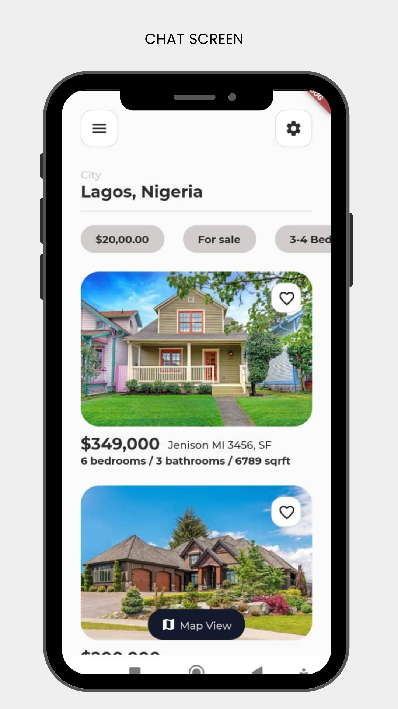

# UI Challenge

Five days challenge

## Description
5 days UI challenge to master building good Flutter UIs.

## Screens Built
1. Chat app screen
2. Cloud Storage app screen
3. Food delivery app screen
4. Real Estate app screen
5. Modern wallet page

## Getting Started
The first step to testing or running this app is getting the code

    git clone https://github.com/kennethOkwong/5_days_UI_challenge.git
    .
    .
    flutter pub get on your chosen project

Run the app to confirm that everything works
    
    flutter run

## App Screens
App screens are shown below:

### Chat App

### Cloud Storage

### Food Delivery

### Real Estate

### Wallet Page

